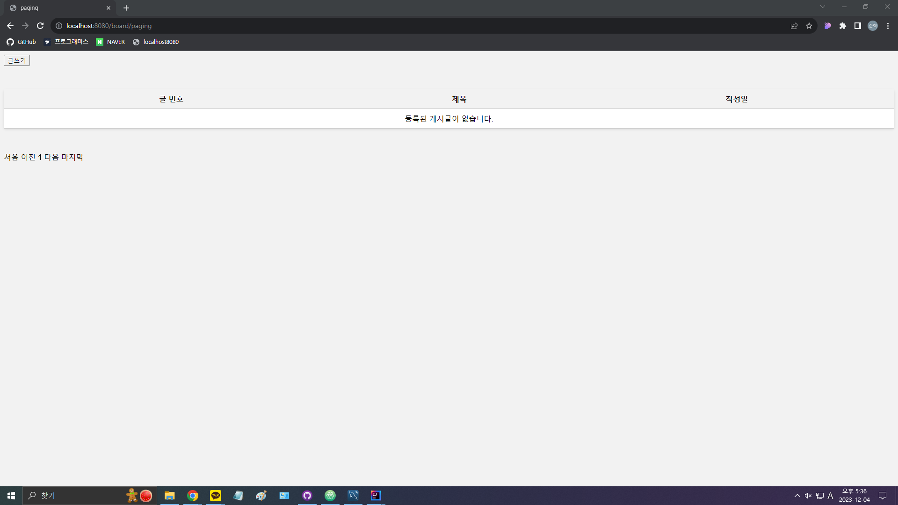
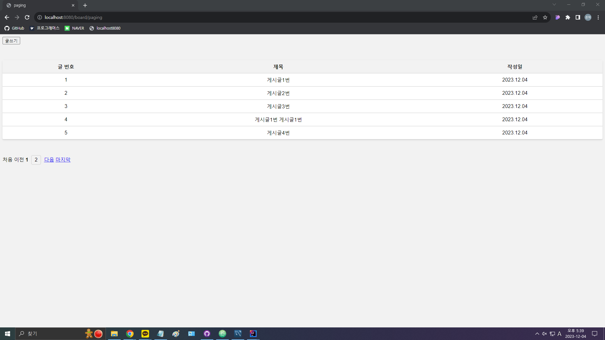
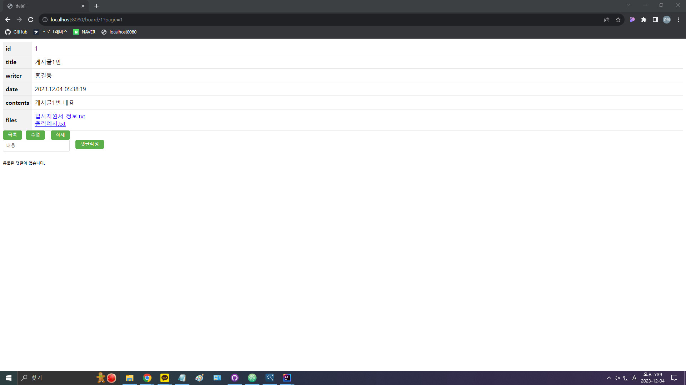
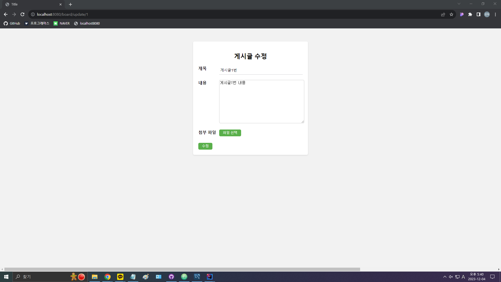
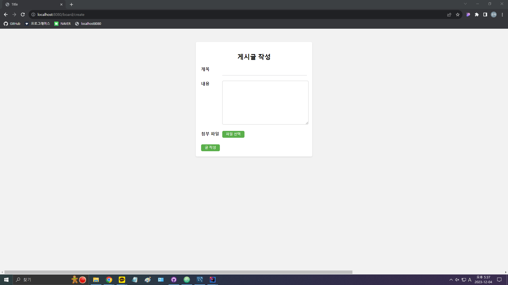
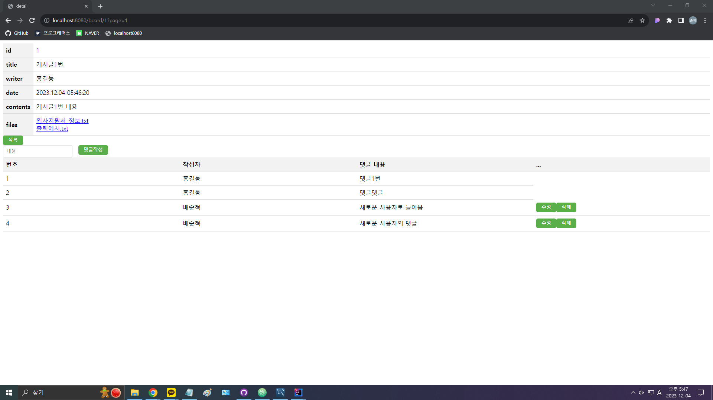
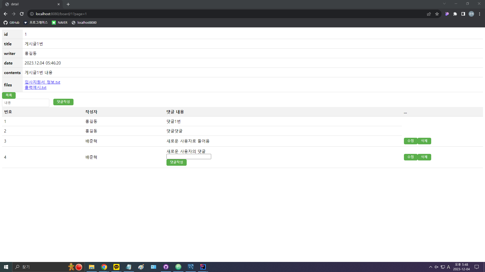
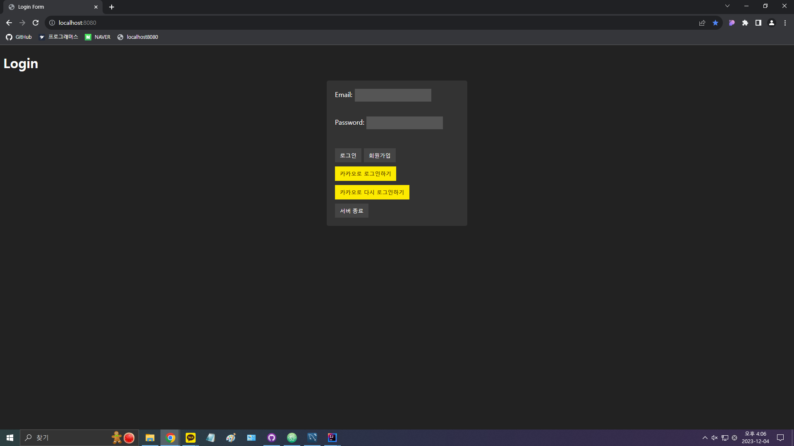
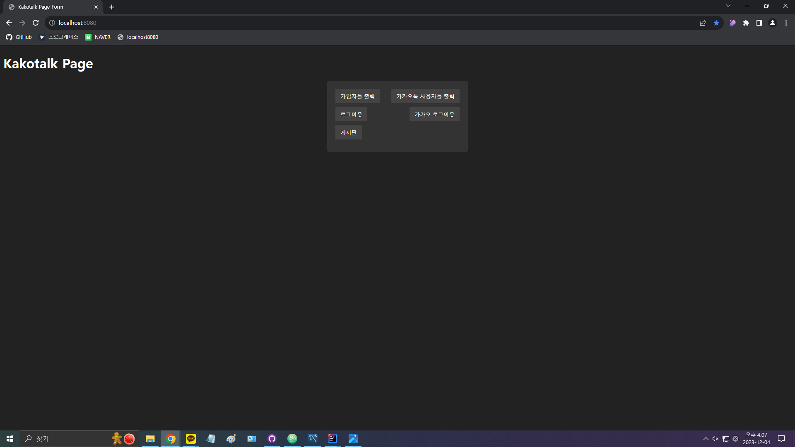
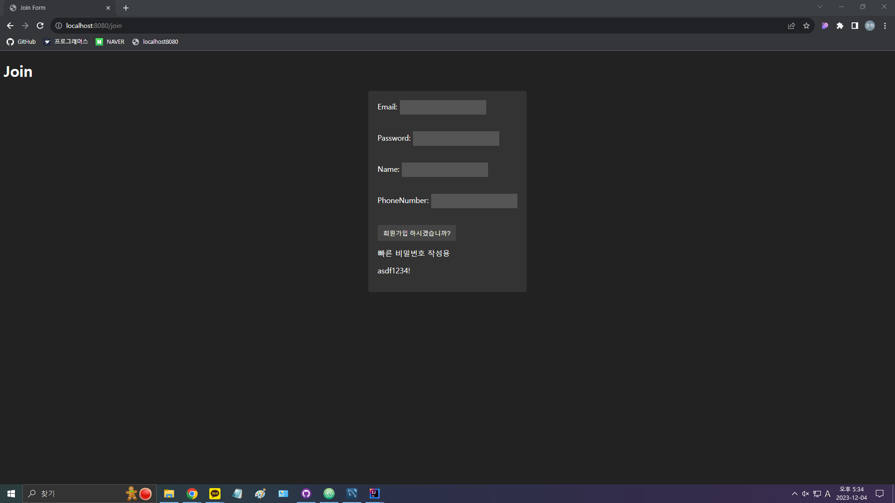

# shopBoard v2.2.2

## ※ 개발환경
###### (aplication.yml)
IDE: IntelliJ IDEA Community   
Gradle - Groovy, Java 17   
Jar 11   
Spring Boot 2.7.6   
jvm.convert 3.3.2   
JDK 11   
mysql 8.0.35   
Lombok   
Spring Web   
Spring Data JPA   
Thymeleaf   

## ※ 게시판 주요기능
### 게시글
1. 게시글 작성(/board/save)  
  \- 파일(이미지) 첨부 (단일/다중)

2. 게시판 페이지(/board/, /board/paging)  
  \- 한 페이지 게시글 5개  
  \- 최대 3개 페이지씩  
  \- /board/paging?page=1  
  \- /board/paging/1   

       
       

3. 게시글 조회(/board/{id})   

     
 

4. 게시글 수정(/board/update/{id})  
  \- 상세화면에서 수정 버튼 클릭 (작성자일 경우에만 보임)  
  \- 서버에서 해당 게시글의 정보를 가지고 수정 화면 출력   

     

5. 게시글 수정 적용(/board/update)  
  \- 제목, 내용 수정 입력 받아서 서버로 요청    

6. 게시글 삭제(/board/delete/{id})  
  \- 상세화면에서 삭제 버튼 클릭 (작성자일 경우에만 보임)

7. 게시글 작성 화면으로 이동(/board/create)   

     
 

### 댓글
1. 댓글 작성(/comment/save)

2. 게시글에 달린 댓글들 보이기(/comment/comments)   

     
     

3. 댓글 삭제(/comment/delete/{id})  
  \- 작성자일 경우에 보이는 댓글 옆 삭제 버튼 클릭

4. 댓글 수정(/comment/update)  
  \- 작성자일 경우에 보이는 댓글 옆 수정 버튼 클릭  
  \- 댓글 내용 아래에 작성공간과 댓글작성 버튼이 나옴  
  \- 작성공간에 새로운 내용을 적고 댓글작성 버튼을 누르면 입력한 내용으로 서버로 요청  
  \- 수정 버튼을 한 번 더 누르면 작성공간과 댓글 작성버튼이 사라짐   

### 파일 다운로드
1. 게시글에 첨부한 파일(이미지) 다운(/download/{uuid}/{filename})

## ※ 회원가입 및 로그인 주요기능 [kakaoLogin Project](https://github.com/mearae/kakaoLogin)
### 일반 회원
1. 회원가입(/user/join)  
  \- 이메일, 비밀번호, 이름, 전화번호

2. 이메일 중복 확인(/user/check)

3. 로그인(/user/login)

4. 로그인 인증토큰 발급(/user/oauth)

5. 로그아웃(/user/logout)  
  \- 모든 플랫폼에서 로그아웃 가능

6. 가입된 회원들 출력(/user/users)  
  \- 프로그램 정상 실행 확인용

7. 로그인한 회원 자신의 id(/user/user_id)  
  \- 프로그램 내에서만 사용(직접 사용 불가)

8. 토큰 갱신(/user/refresh)

9. 로그인한 회원 자신의 id 전송(/user/send_user_id)  
  \- 프로그램 내에서만 사용(직접 사용 불가)

### 카카오톡 회원
1. 카카오톡으로 회원가입 및 로그인(/kakao/callback)

2. 카카오톡 인증코드 발급(/kakao/oauth)

3. 카카오톡로 다시 로그인(/kakao/relogin)  
  \- 프로그램 정상 실행 확인용

4. 카카오톡로 로그아웃(/kakao/logout)  
  \- 카카오톡은 로그아웃 안 됨

5. 카카오톡도 함께 로그아웃(/kakao/fulllogout)

6. 카카오톡과 웹 연결 끊기(/kakao/disconnect)

7. 카카오톡 회원들 출력(/kakao/userlist)  
  \- 프로그램 정상 실행 확인용

8. 서버 종료(/kakao/end)  
  \- 프로그램 정상 실행 확인용

## ※ 화면이동
1. 메인 화면 이동(/)  
  \- 로그인 여부를 보고 로그인 화면 혹은 로그인 후 화면으로 이동시켜줌   

       
       

2. 회원가입 화면 이동(/join)   

   

## ※ 향후 업데이트 예정 기능
1. 자신이 작성한 게시글 모아보기

2. 작성자의 게시글 모아보기

3. 게시글 수정 시 이전에 첨부한 파일들도 보이기

#    
#### v2.2.2(2023.12.04)
1. [수정] 카카오톡도 함께 로그아웃(/kakao/fulllogout)  
 \- 로그아웃 후 나오는 화면 및 기타 오류 수정
2. 댓글 수정 및 삭제 버튼이 작성자에게만 보이도록 오류를 수정

#### v2.2.1(2023.12.03)
1. 자신의 게시글만 수정, 삭제 가능하도록 버튼 설정
2. 자신의 댓글만 수정, 삭제 가능하도록 버튼 설정
3. 댓글 수정 버튼을 눌렀을 경우 작성공간과 댓글작성 버튼이 나옴
4. 댓글 수정 버튼을 한 번 더 반복해서 누르면 수정이 취소됨

#### v2.2.0(2023.12.03)
1. [추가] 댓글 삭제(/comment/delete/{id})
2. [추가] 댓글 수정(/comment/update)  
  \- 작성공간에 새로운 내용을 적고 댓글작성 버튼을 누르면 입력한 내용으로 서버로 요청
3. [삭제] 로그인 후 화면으로 이동(/logined)  
  \- 메인 화면 이동(/)과 기능 합침

#### v2.1.0 (2023.12.02)
1. [수정] 메인 페이지 이동(/)  
  \- 메인 페이지 수정  
  \- 로그인한 경우 로그인 후 화면으로 자동 이동   
2. [수정] 로그인 후 화면으로 이동(/logined)  
  \- 로그인 안 된 경우 로그인 화면으로 자동 이동
3. [삭제] 로그인 했는지 확인(/user/accessed)  
  \- 활용을 더이상 안 함

#### v2.0.1 (2023.12.01)
1. 게시글에 작성자 표시
2. 게시글 수정 시 이전 제목, 내용 표시
3. KakaoLogin 보안 강화 및 일부 버그 수정

#### v2.0.0 (2023.12.01)
1. kakaoLogin과 취합
2. [추가] 로그인 후 화면으로 이동(/logined)
3. [추가] 회원가입 화면으로 이동(/join)

#### v1.4.2 (2023.11.30)
1. 화면 디자인 수정
2. 게시판 페이지 번호 표시 수정  
  \- 등록된 게시글 없을 시 따로 표시  
  \- 첫 페이지일 경우 처음, 이전 버튼 선택 불가  
  \- 마지막 페이지일 경우 다음, 마지막 버튼 선택 불가

#### v1.4.1 (2023.11.29)
1. 화면 디자인 수정
2. 게시글에 첨부한 파일 이름 표시
3. 게시글의 다운할 첨부파일 이름 표시

#### v1.4.0 (2023.11.28)
1. [추가] 게시글에 첨부한 파일(이미지) 다운(/download/{uuid}/{filename})
2. 게시글에 달린 댓글들 들어갈 때마다 항상 나오도록 수정

#### v1.3.0 (2023.11.27)
1. [수정] 게시글 작성(/board/save)  
  \- 파일(이미지) 첨부 (단일/다중)
2. [추가] 게시글 수정 적용(/board/update)  
  \- 첨부한 파일(이미지) 수정 가능

#### v1.2.0 (2023.11.24)
1. [추가] 댓글 작성(/comment/save)
2. [추가] 게시글에 달린 댓글들 보이기(/comment/comments)

#### v1.1.0 (2023.11.23)
1. [추가] 게시판 페이지 보기(/board/paging, /board/)  
  \- 한 페이지 5개씩  
  \- 페이지 최대 3개씩
2. [추가] 게시글 작성 화면으로 이동(/board/create)
3. [추가] 게시글 조회(/board/{id})  
  \- 글번호, 제목, 작성일, 내용  
  \- 목록, 수정, 삭제 버튼
4. [추가] 게시글 수정(/board/update/{id})
5. [추가] 게시글 수정 적용(/board/update)
6. [추가] 게시글 삭제(/board/{id})

#### v1.0.0 (2023.11.21)
1. [추가] 게시글 작성(/board/save)  
  \- 제목, 내용
2. [추가] 메인 페이지 이동(/)
